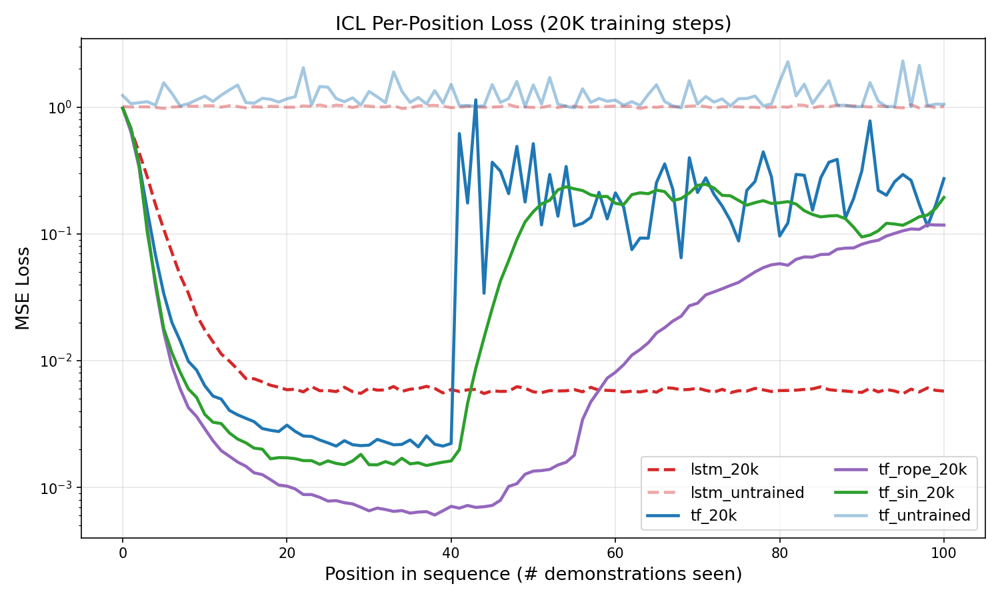

# ICL Generalization

Compare **in-context learning (ICL) generalization** across different sequence-to-sequence models: given a sequence of (input, output) demonstration pairs from some function, how well can each architecture predict the output for a new query input — without any weight updates?

## Overview

The project studies three families of models:

- **Recurrent models** (e.g., LSTM, GRU) — process the sequence token-by-token with hidden state.
- **Transformer-based models** (self-attention) — attend over the full sequence context (with learned, sinusoidal, or RoPE positional encodings).
- **Deterministic / algorithmic baselines** (e.g., ridge regression) — reference for what an optimal learner would do.

Models are evaluated in two regimes:

1. **Random initialization** — inductive bias of the architecture.
2. **After training** — behavior when trained on a distribution of ICL tasks.

Each ICL instance is a sequence of the form `x_1, y_1, x_2, y_2, ..., x_k, y_k, x_query → ?` where `y_i = f(x_i)` for a function `f` from a configurable class (e.g., linear maps). Inputs and outputs are continuous real vectors; the model uses continuous token embeddings. Loss and metrics are computed only at output positions. Everything is configurable via a single config (Pydra) with CLI overrides.

## Setup

```bash
cd icl_generalization
python -m venv .venv
source .venv/bin/activate   # or: .venv\Scripts\activate on Windows
pip install -r requirements.txt
```

**Requirements:** Python 3.x, PyTorch ≥ 2.0, [pydra-config](https://github.com/jordan-benjamin/pydra), matplotlib.

## How to run

**Train** (default: transformer on linear ICL task):

```bash
python scripts/train.py
```

Examples:

```bash
# LSTM
python scripts/train.py model.type=lstm model.n_layers=2

# Override hyperparameters
python scripts/train.py model.d_model=256 training.lr=3e-4

# Preview config without running
python scripts/train.py --show
```

Checkpoints are saved under `checkpoints/` (path configurable via `training.checkpoint_dir`).

**Evaluate** per-position ICL loss (untrained or from a checkpoint):

```bash
# Untrained transformer
python scripts/eval_icl.py model.type=transformer label=tf_untrained

# Trained model
python scripts/eval_icl.py model.type=transformer checkpoint=checkpoints/transformer/step_20000.pt label=tf_20k

# LSTM
python scripts/eval_icl.py model.type=lstm model.n_layers=2 label=lstm_untrained
```

Results are written as JSON under `results/`.

**Plot** loss curves from evaluation JSONs:

```bash
python scripts/plot_icl.py results/*.json -o plots/icl_comparison.png
python scripts/plot_icl.py results/*.json --logy -o plots/icl_comparison_log.png
```

## Results

Per-position MSE loss (y-axis) vs. number of demonstrations seen (x-axis) for several models after 20K training steps, plus untrained baselines. Lower is better.



- **Untrained** (`tf_untrained`, `lstm_untrained`): loss stays high (~1.0); no in-context learning without training.
- **Trained models** start near 1.0 at position 0 and improve as more demonstrations are seen. **Transformer with RoPE** (`tf_rope_20k`) drops fastest and stays among the best; **LSTM** (`lstm_20k`) is more stable across long sequences. **Standard transformer** (`tf_20k`) and **sinusoidal PE** (`tf_sin_20k`) learn well early but can degrade or become unstable after ~40+ demonstrations, while RoPE and LSTM generalize more robustly to longer contexts.

This figure is generated from the evaluation JSONs in `results/` using `scripts/plot_icl.py` and saved as `plots/icl_comparison_v3.png`.
